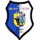

|   Datum    | Spiel |                                                                    Heim | **Endstand** | Auswärts                                                                |                                             YT                                             |
|:----------:|:-----:|------------------------------------------------------------------------:|:------------:|:------------------------------------------------------------------------|:------------------------------------------------------------------------------------------:|
| 08.08.2009 | VL01  |               SV Blau-Weiß Polz  |   **0:5**    |  1.FC Neubrandenburg 04  |                                                                                            |
| 15.08.2009 | VL02  |                  Rostocker FC  |   **0:6**    |  1.FC Neubrandenburg 04  |                                                                                            |
| 23.08.2009 | VL03  |          HSG Uni Greifswald  |   **2:6**    |  1.FC Neubrandenburg 04  |  |
| 29.08.2009 | VL04  |  1.FC Neubrandenburg 04  |   **1:0**    |  TSV Graal-Müritz              |                                                                                            |
| 05.09.2009 |  LP2  |         Kickers JuS  |   **1:5**    |  1.FC Neubrandenburg 04  |                                                                                            |
| 13.09.2009 | VL05  |             FC Anker Wismar  |   **3:0**    |  1.FC Neubrandenburg 04  |                                                                                            |
| 19.09.2009 | VL06  |  1.FC Neubrandenburg 04  |   **1:0**    |  FC Schönberg 95       |                                                                                            |
| 26.09.2009 | VL07  | Sievershäger SV  |   **1:2**    |  1.FC Neubrandenburg 04  |                                                                                            |
| 03.10.2009 | VL08  |  1.FC Neubrandenburg 04  |   **7:1**    |  Pasewalker FV           |  |
| 10.10.2009 |  LP3  |           Malchower SV II  |   **0:2**    |  1.FC Neubrandenburg 04  |  |
| 17.10.2009 | VL09  |   FC Vorwärts Drögeheide  |   **1:3**    |  1.FC Neubrandenburg 04  |  |
| 24.10.2009 | VL10  |  1.FC Neubrandenburg 04  |   **5:3**    |  SV Waren 09                   |  |
| 31.10.2009 | VL11  |   Greifswalder SV 04 II  |   **0:0**    |  1.FC Neubrandenburg 04  |  |
| 07.11.2009 | VL12  |  1.FC Neubrandenburg 04  |   **3:0**    |  FSV 1919 Malchin          |  |
| 14.11.2009 | VL13  |     FC Eintracht Schwerin  |   **4:0**    |  1.FC Neubrandenburg 04  |                                                                                            |
| 28.11.2009 | VL14  |          TSV 1814 Friedland  |   **0:1**    |  1.FC Neubrandenburg 04  |  |
| 05.12.2009 | VL15  |  1.FC Neubrandenburg 04  |   **6:0**    |  SV Warnemünde                 |  |
| 12.12.2009 |  LP4  |  1.FC Neubrandenburg 04  |   **3:2**    |  Greifswalder SV 04      |                                                                                            |
| 20.02.2010 | VL17  |  1.FC Neubrandenburg 04  |   **2:1**    |  Rostocker FC                      |  |
| 27.02.2010 | VL18  |  1.FC Neubrandenburg 04  |   **4:0**    |  HSG Uni Greifswald          |  |
| 07.03.2010 | VL19  |              TSV Graal-Müritz  |   **1:3**    |  1.FC Neubrandenburg 04  |  |
| 13.03.2010 | VL20  |  1.FC Neubrandenburg 04  |   **0:3**    |  FC Anker Wismar             |  |
| 21.03.2010 | VL21  |       FC Schönberg 95  |   **2:3**    |  1.FC Neubrandenburg 04  |  |
| 27.03.2010 | VL22  |  1.FC Neubrandenburg 04  |   **1:3**    |  Sievershäger SV |  |
| 01.04.2010 | LPAF  |                   SV Waren 09  |   **2:1**    |  1.FC Neubrandenburg 04  |  |
| 10.04.2010 | VL23  |           Pasewalker FV  |   **0:5**    |  1.FC Neubrandenburg 04  |  |
| 17.04.2010 | VL24  |  1.FC Neubrandenburg 04  |   **1:0**    |  FC Vorwärts Drögeheide   |  |
| 24.04.2010 | VL26  |                   SV Waren 09  |   **2:2**    |  1.FC Neubrandenburg 04  |  |
| 08.05.2010 | VL27  |          FSV 1919 Malchin  |   **0:2**    |  1.FC Neubrandenburg 04  |  |
| 15.05.2010 | VL28  |  1.FC Neubrandenburg 04  |   **3:1**    |  FC Eintracht Schwerin     |  |
| 22.05.2010 | VL16  |  1.FC Neubrandenburg 04  |   **7:0**    |  SV Blau-Weiß Polz               |  |
| 29.05.2010 | VL29  |  1.FC Neubrandenburg 04  |   **5:0**    |  TSV 1814 Friedland          |                                                                                            |
| 05.06.2010 | VL30  |                 SV Warnemünde  |   **2:0**    |  1.FC Neubrandenburg 04  |                                                                                            |

Tabelle 2009/10:

| #  | Verein                                                                  | S  | G  | U  | V  | Tore  | TV  | **P**  |
|:--:|:------------------------------------------------------------------------|:--:|:--:|:--:|:--:|:-----:|:---:|:------:|
| 1  |  **FC Anker Wismar**         | 29 | 23 | 6  | 0  | 83:10 | 73  | **75** | 
| 2  |  1. FC Neubrandenburg 04 | 29 | 22 | 2  | 5  | 84:30 | 54  | **68** | 
| 3  |  Sievershäger SV | 29 | 21 | 3  | 5  | 70:34 | 36  | **66** | 
| 4  |  FC Schönberg 95       | 29 | 20 | 3  | 6  | 72:27 | 45  | **63** | 
| 5  |  FC Eintracht Schwerin     | 29 | 13 | 5  | 11 | 54:42 | 12  | **44** | 
| 6  |  SV Waren 09                   | 29 | 14 | 2  | 13 | 42:47 | −5  | **44** | 
| 7  |  Rostocker FC                  | 29 | 12 | 7  | 10 | 62:47 | 15  | **43** | 
| 8  |  FC Vorwärts Drögeheide   | 29 | 12 | 5  | 12 | 45:40 |  5  | **41** | 
| 9  |  TSV Graal-Müritz (N)          | 29 | 11 | 6  | 12 | 38:50 | −12 | **39** | 
| 10 |  FSV 1919 Malchin          | 29 | 10 | 6  | 13 | 34:51 | −17 | **36** | 
| 11 |  SV Warnemünde                 | 29 | 6  | 9  | 14 | 32:63 | −31 | **27** |
| 12 |  Uni Greifswald (N)          | 29 | 4  | 11 | 14 | 34:66 | −32 | **23** |
| 13 |  TSV 1814 Friedland (N)      | 29 | 6  | 4  | 19 | 23:61 | −38 | **22** |
| 14 |  _Pasewalker FV_         | 29 | 4  | 5  | 20 | 30:78 | −48 | **17** |
| 15 |  _SV Blau-Weiß Polz_             | 29 | 4  | 3  | 22 | 30:87 | −57 | **15** |
| 16 |  _Greifswalder SV 04 II_ | 15 | 3  | 3  | 9  |  0:0  |  0  | **12** |

__Aufsteiger:__ FC Anker Wismar 
_Absteiger:_ Pasewalker FV, SV Blau-Weiß Polz, Greifswalder SV 04 II (zurückgezogen) 
Vorsaison: (A)=Absteiger, (N)=Neuling/Aufsteiger 
Anmerkungen: HSG Uni Greifswald übernahm den Startplatz von der VSG Weitenhagen

Rest:

|   Datum    | Spiel |                                                                   Heim | **Endstand** | Auswärts                                                           |                                             YT                                             |
|:----------:|:-----:|-----------------------------------------------------------------------:|:------------:|:-------------------------------------------------------------------|:------------------------------------------------------------------------------------------:|
| 17.02.2010 | Test  | 1.FC Neubrandenburg 04  |   **5:2**    |  Greifswalder SV 04 |  |