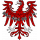
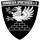

|   Datum    | Spiel |                                                                       Heim | **Endstand** | Auswärts                                                                   |                                             YT                                             |
|:----------:|:-----:|---------------------------------------------------------------------------:|:------------:|:---------------------------------------------------------------------------|:------------------------------------------------------------------------------------------:|
| 08.08.2015 |  LP1  |           Penkuner SV Rot-Weiß  |   **1:3**    |  1.FC Neubrandenburg 04           |                                                                                            |
| 16.08.2015 | OL01  |                 SV Altlüdersdorf  |   **1:1**    |  1.FC Neubrandenburg 04           |  | 
| 22.08.2015 | OL02  |           1.FC Neubrandenburg 04  |   **2:0**    |  SV Victoria Seelow             |                                                                                            |
| 28.08.2015 | OL03  |   Hertha 03 Zehlendorf  |   **2:2**    |  1.FC Neubrandenburg 04           |  | 
| 05.09.2015 |  LP2  |                       Doberaner FC  |   **3:1**    |  1.FC Neubrandenburg 04           |                                                                                            |
| 12.09.2015 | OL04  |           1.FC Neubrandenburg 04  |   **4:1**    |  SV Lichtenberg 47                    |                                                                                            | 
| 20.09.2015 | OL05  |           1.FC Neubrandenburg 04  |   **2:1**    |  CFC Hertha 06            |  | 
| 26.09.2015 | OL06  |              1.FC Frankfurt/Oder  |   **5:1**    |  1.FC Neubrandenburg 04           |  | 
| 04.10.2015 | OL07  |           1.FC Neubrandenburg 04  |   **9:1**    |  BSV Hürtürkel            |  | 
| 24.10.2015 | OL09  |           1.FC Neubrandenburg 04  |   **0:0**    |  FC Hansa Rostock II              |  | 
| 01.11.2015 | OL10  |          FC Strausberg  |   **2:2**    |  1.FC Neubrandenburg 04           |  | 
| 07.11.2015 | OL11  |           1.FC Neubrandenburg 04  |   **1:2**    |  Tennis Borussia Berlin             |  | 
| 14.11.2015 | OL08  | SV Germania Schöneiche  |   **1:0**    |  1.FC Neubrandenburg 04           |  | 
| 20.11.2015 | OL12  |              Malchower SV 90  |   **3:2**    |  1.FC Neubrandenburg 04           |  | 
| 28.11.2015 | OL13  |           1.FC Neubrandenburg 04  |   **3:2**    |  FC Anker Wismar                |  | 
| 06.12.2015 | OL14  |             FSV Union Fürstenwalde  |   **3:1**    |  1.FC Neubrandenburg 04           |  | 
| 12.12.2015 | OL15  |           1.FC Neubrandenburg 04  |   **0:2**    |  Brandenburger SC Süd 05        |                                                                                            | 
| 21.02.2016 | OL16  |           1.FC Neubrandenburg 04  |   **2:4**    |  SV Altlüdersdorf                 |  | 
| 28.02.2016 | OL17  |             SV Victoria Seelow  |   **2:0**    |  1.FC Neubrandenburg 04           |                                                                                            | 
| 05.03.2016 | OL18  |           1.FC Neubrandenburg 04  |   **0:4**    |  Hertha 03 Zehlendorf   |  | 
| 13.03.2016 | OL19  |                    SV Lichtenberg 47  |   **1:1**    |  1.FC Neubrandenburg 04           |                                                                                            | 
| 20.03.2016 | OL20  |            CFC Hertha 06  |   **1:1**    |  1.FC Neubrandenburg 04           |                                                                                            | 
| 02.04.2016 | OL21  |           1.FC Neubrandenburg 04  |   **3:0**    |  1.FC Frankfurt/Oder              |                                                                                            | 
| 10.04.2016 | OL22  |            BSV Hürtürkel  |   **1:2**    |  1.FC Neubrandenburg 04           |  | 
| 17.04.2016 | OL23  |           1.FC Neubrandenburg 04  |   **1:2**    |  SV Germania Schöneiche |  | 
| 24.04.2016 | OL24  |              FC Hansa Rostock II  |   **3:0**    |  1.FC Neubrandenburg 04           |                                                                                            | 
| 30.04.2016 | OL25  |           1.FC Neubrandenburg 04  |   **1:1**    |  FC Strausberg          |                                                                                            | 
| 08.05.2016 | OL26  |             Tennis Borussia Berlin  |   **5:0**    |  1.FC Neubrandenburg 04           |  | 
| 13.05.2016 | OL27  |           1.FC Neubrandenburg 04  |   **3:4**    |  Malchower SV 90              |  | 
| 21.05.2016 | OL28  |                FC Anker Wismar  |   **2:3**    |  1.FC Neubrandenburg 04           |                                                                                            | 
| 05.06.2016 | OL29  |           1.FC Neubrandenburg 04  |   **2:5**    |  FSV Union Fürstenwalde             |  | 
| 12.06.2016 | OL30  |        Brandenburger SC Süd 05  |   **0:4**    |  1.FC Neubrandenburg 04           |  | 

Tabelle 2015/16:

| #  | Verein                                                                   | S  | G  | U | V  |  Tore  |  TV  | **P**  |
|:--:|:-------------------------------------------------------------------------|:--:|:--:|:-:|:--:|:------:|:----:|:------:|
| 1  |  **FSV Union Fürstenwalde**       | 30 | 22 | 3 | 5  | 84:35  |  49  | **69** | 
| 2  |  FC Hansa Rostock II            | 30 | 20 | 5 | 5  | 78:30  |  48  | **65** | 
| 3  | H ertha 03 Zehlendorf | 30 | 19 | 2 | 9  | 75:37  |  38  | **59** | 
| 4  |  Tennis Borussia Berlin (N)       | 30 | 16 | 7 | 7  | 55:35  |  20  | **55** | 
| 5  |  SV Lichtenberg 47                  | 30 | 16 | 5 | 9  | 54:34  |  20  | **53** | 
| 6  |  Malchower SV               | 30 | 15 | 3 | 12 | 65:46  |  19  | **48** | 
| 7  |  FC Anker Wismar (N)          | 30 | 13 | 6 | 11 | 59:36  |  23  | **45** | 
| 8  |  Germania Schöneiche  | 30 | 11 | 7 | 12 | 32:30  |  2   | **40** | 
| 9  |  SV Victoria Seelow (N)       | 30 | 10 | 9 | 11 | 38:46  |  -8  | **39** | 
| 10 |  SV Altlüdersdorf               | 30 | 11 | 5 | 14 | 49:56  |  -7  | **38** | 
| 11 |  CFC Hertha 06 (N)      | 30 | 10 | 7 | 13 | 45:49  |  -4  | **37** |
| 12 |  _1.FC Neubrandenburg 04_       | 30 | 10 | 6 | 14 | 55:61  |  -6  | **36** |
| 13 |  Brandenburger SC Süd 05      | 30 | 9  | 6 | 15 | 38:11  | -23  | **33** |
| 14 |  FC Strausberg        | 30 | 7  | 9 | 14 | 29:48  | -19  | **30** |
| 15 |  1.FC Frankfurt/Oder (N)        | 30 | 6  | 3 | 21 | 31:77  | -46  | **21** |
| 16 |  _BSV Hürtürkel_        | 30 | 3  | 1 | 26 | 24:130 | -106 | **10** |
__Aufsteiger:__ FSV Unon Fürstenwalde 
_Absteiger:_ 1.FC Neubrandenburg 04 (Insolvenz), BSV Hürtürkel 
Vorsaison: (A)=Absteiger, (N)=Neuling/Aufsteiger (Einführung der Regionalliga Nordost) 
 
Rest:

|   Datum    | Spiel |                                                                       Heim | **Endstand** | Auswärts                                                                   |                                             YT                                             |
|:----------:|:-----:|---------------------------------------------------------------------------:|:------------:|:---------------------------------------------------------------------------|:------------------------------------------------------------------------------------------:|
| 15.07.2015 | Test  |           1.FC Neubrandenburg 04  |   **1:1**    |  Grimmener SV                       |  |
| 31.07.3015 | Test  |           1.FC Neubrandenburg 04  |   **7:2**    |  Förderkader René Schneider         |  |
| 12.02.2016 | Test  |           1.FC Neubrandenburg 04  |   **1:3**    |  Güstrower SC                   |  |
| 24.06.2016 | Test  |           1.FC Neubrandenburg 04  |   **1:3**    |  FC Hansa Rostock                 |  | 
